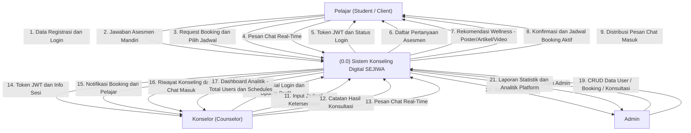
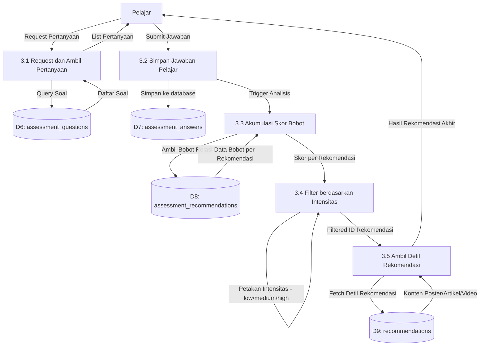
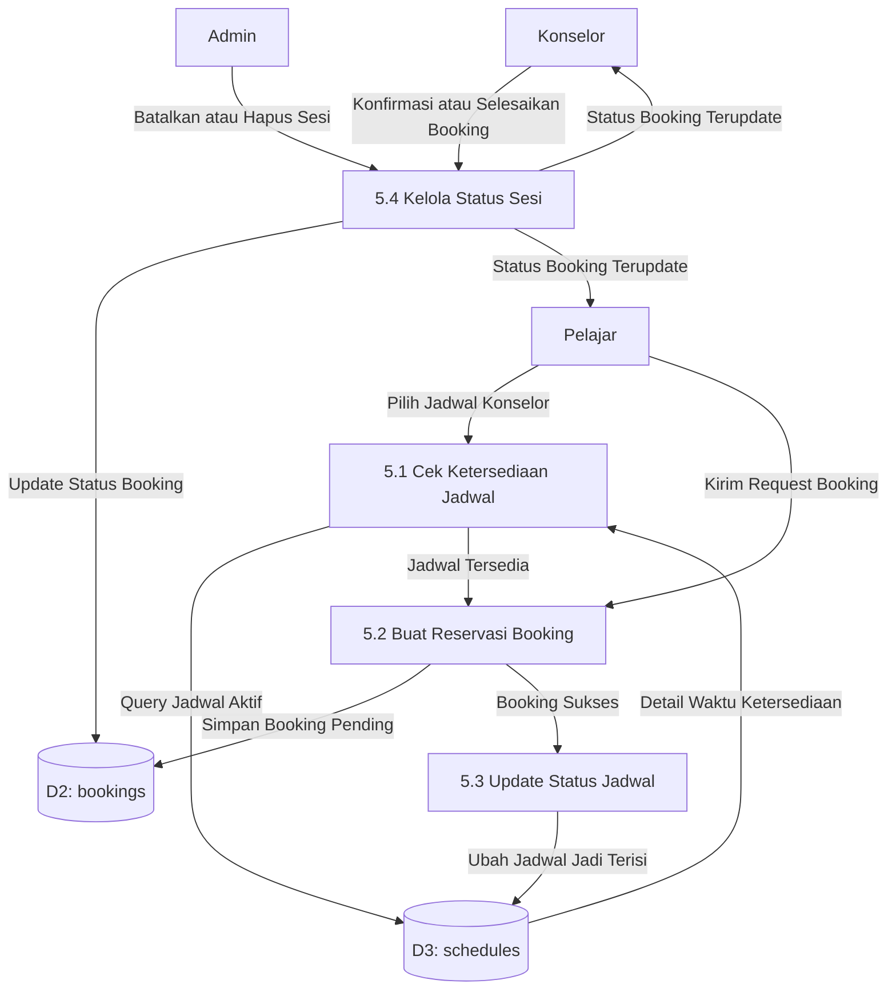
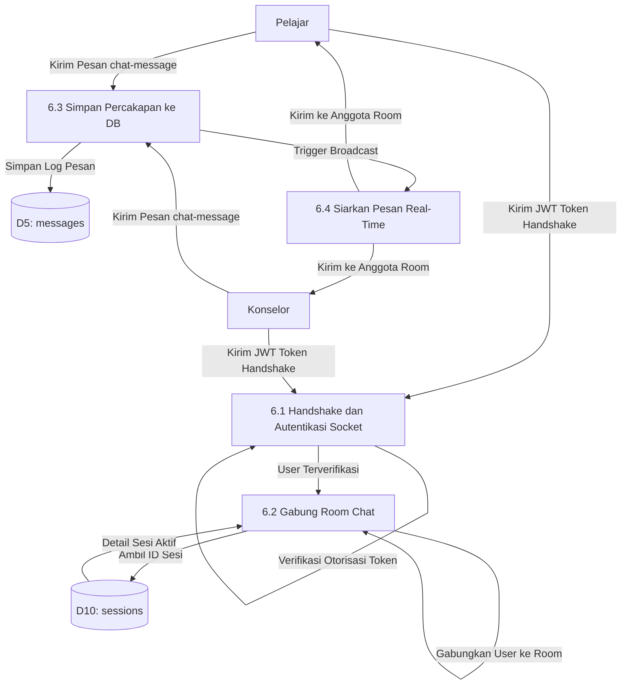

# Dokumentasi Data Flow Diagram (DFD) - SEJIWA (Self Journey to Wellness Awareness)

Dokumen ini mendefinisikan rancangan aliran data (**Data Flow Diagram / DFD**) untuk platform konseling digital **SEJIWA**, berdasarkan arsitektur backend nyata yang diimplementasikan menggunakan **Express.js**, **PostgreSQL** (melalui Node-Postgres `pg` pool dan `Sequelize`), serta **Socket.io** (WebSockets).

---

## 1. Entitas Eksternal (External Entities)
Sistem memiliki tiga aktor utama yang berinteraksi secara langsung:
1. **Pelajar (Student / Client)**: Pengguna utama yang melakukan asesmen mandiri, melihat jadwal, melakukan pemesanan sesi, dan berinteraksi dalam chat konseling.
2. **Konselor (Counselor)**: Tenaga ahli yang menentukan jadwal ketersediaan, mendampingi pelajar dalam sesi chat real-time, melihat analitik dasar, dan menginput catatan konsultasi.
3. **Admin**: Pengelola sistem yang memiliki hak akses penuh untuk mengelola pengguna, menghapus data booking yang tidak valid, serta memantau statistik platform secara menyeluruh.

---

## 2. Penyimpanan Data (Data Stores)
Aliran data pada sistem ini disimpan ke dalam tabel PostgreSQL berikut:
- **D1: users** (`users`): Menyimpan data akun pengguna (username, email, password terenkripsi, role `pelajar`/`konselor`/`admin`, dan profil foto Cloudinary).
- **D2: bookings** (`bookings`): Menyimpan reservasi jadwal konseling oleh Pelajar dengan Konselor terkait.
- **D3: schedules** (`schedules`): Menyimpan jadwal ketersediaan waktu dari masing-masing Konselor.
- **D4: consultations** (`consultations`): Menyimpan riwayat rekam medis/catatan hasil sesi konseling yang ditulis oleh Konselor.
- **D5: messages** (`messages`): Menyimpan riwayat pesan percakapan chat real-time.
- **D6: assessment_questions** (`assessment_questions`): Daftar pertanyaan asesmen emosional/kesehatan mental.
- **D7: assessment_answers** (`assessment_answers`): Jawaban asesmen yang disubmit oleh pelajar untuk evaluasi berkala.
- **D8: assessment_recommendations** (`assessment_recommendations`): Tabel mapping relasional antara pertanyaan asesmen dengan bobot rekomendasi.
- **D9: recommendations** (`recommendations`): Konten rekomendasi (poster, artikel, video) berdasarkan tingkat intensitas kecemasan/emosi.
- **D10: sessions** (`sessions`): Data sesi konsultasi aktif antara pelajar dan konselor yang mengikat koneksi chat room.

---

## 3. DFD Level 0: Diagram Konteks (Context Diagram)
Diagram Konteks menggambarkan batas sistem secara keseluruhan serta interaksi input-output antara sistem SEJIWA dengan entitas luar.

---

## 4. DFD Level 1: Diagram Fungsional
Pembagian proses fungsional yang terjadi di dalam Sistem SEJIWA untuk mengelola aliran data ke media penyimpanan (Data Stores).

```mermaid
graph TD
    %% Entities
    Pelajar["Pelajar"]
    Konselor["Konselor"]
    Admin["Admin"]

    %% Data Stores
    D1[("D1: users")]
    D2[("D2: bookings")]
    D3[("D3: schedules")]
    D4[("D4: consultations")]
    D5[("D5: messages")]
    D6[("D6: assessment_questions")]
    D7[("D7: assessment_answers")]
    D8[("D8: assessment_recommendations")]
    D9[("D9: recommendations")]
    D10[("D10: sessions")]

    %% Processes
    P1["1.0 Autentikasi dan Registrasi"]
    P2["2.0 Manajemen Pengguna"]
    P3["3.0 Asesmen dan Rekomendasi"]
    P4["4.0 Manajemen Jadwal"]
    P5["5.0 Pemesanan Sesi"]
    P6["6.0 Konseling Interaktif"]
    P7["7.0 Catatan Konsultasi"]
    P8["8.0 Analitik dan Dashboard"]

    %% 1.0 Flows
    Pelajar -->|Registrasi / Login| P1
    Konselor -->|Registrasi / Login| P1
    Admin -->|Login Admin| P1
    P1 -->|Simpan dan Cek Kredensial| D1
    D1 -->|Data User Valid| P1
    P1 -->|JWT Token / Cookies| Pelajar
    P1 -->|JWT Token / Cookies| Konselor
    P1 -->|JWT Token / Cookies| Admin

    %% 2.0 Flows
    Pelajar -->|Update Profil dan Foto| P2
    Konselor -->|Update Profil dan Foto| P2
    P2 -->|Update Kolom Profile| D1
    D1 -->|Data Profil Terbaru| P2
    P2 -->|Status Pembaruan| Pelajar
    P2 -->|Status Pembaruan| Konselor

    %% 3.0 Flows
    Pelajar -->|Minta Pertanyaan Asesmen| P3
    P3 -->|Ambil Soal| D6
    P3 -->|Kirim Soal| Pelajar
    Pelajar -->|Submit Jawaban Asesmen| P3
    P3 -->|Simpan Jawaban| D7
    P3 -->|Cek Bobot Asesmen| D8
    P3 -->|Ambil Konten Sesuai Intensitas| D9
    P3 -->|Hasil Skor dan Rekomendasi| Pelajar

    %% 4.0 Flows
    Konselor -->|Kelola Jadwal - POST/PUT/DELETE| P4
    P4 -->|Simpan Ketersediaan| D3
    D3 -->|Jadwal Terdaftar| P4
    P4 -->|Status Jadwal Terupdate| Konselor
    Pelajar -->|Minta Daftar Jadwal Konselor| P4
    P4 -->|Fetch Jadwal Aktif| D3
    P4 -->|List Jadwal Konselor| Pelajar

    %% 5.0 Flows
    Pelajar -->|Buat Pemesanan Sesi| P5
    P5 -->|Validasi Jadwal| D3
    P5 -->|Simpan Reservasi Booking| D2
    D2 -->|Detail Booking| P5
    P5 -->|Konfirmasi Sesi Booking| Pelajar
    P5 -->|Notifikasi Booking Baru| Konselor
    Admin -->|Hapus atau Batalkan Booking| P5
    P5 -->|Update Status Booking| D2

    %% 6.0 Flows
    Pelajar -->|Koneksi Socket dan Kirim Chat| P6
    Konselor -->|Koneksi Socket dan Kirim Chat| P6
    P6 -->|Mulai dan Cari Sesi Aktif| D10
    P6 -->|Simpan Percakapan Chat| D5
    P6 -->|Broadcast Pesan melalui Socket.io| Pelajar
    P6 -->|Broadcast Pesan melalui Socket.io| Konselor

    %% 7.0 Flows
    Konselor -->|Tulis Catatan Konsultasi| P7
    P7 -->|Simpan Catatan Sesi| D4
    D4 -->|Fetch Rekam Konsultasi| P7
    P7 -->|Riwayat Catatan Medis| Pelajar
    P7 -->|Riwayat Catatan Medis| Konselor
    Admin -->|Lihat / Hapus Catatan| P7

    %% 8.0 Flows
    Admin -->|Request Data Dashboard| P8
    Konselor -->|Request Data Dashboard| P8
    P8 -->|COUNT Total Users| D1
    P8 -->|COUNT Total Schedules & Grouping| D3
    P8 -->|COUNT Total Assessments| D8
    P8 -->|Tampilan Data Statistik dan Chart| Admin
    P8 -->|Tampilan Data Statistik dan Chart| Konselor
```

---

## 5. DFD Level 2: Diagram Sub-Proses

DFD Level 2 menguraikan sub-sistem utama yang memiliki kompleksitas logika tinggi ke dalam tahapan aliran data yang lebih spesifik.

### 5.1 Proses 3.0: Asesmen Mandiri dan Engine Rekomendasi
Menggambarkan bagaimana data jawaban pelajar diakumulasikan skor bobotnya dan difilter berdasarkan kriteria intensitas (low/medium/high) untuk menampilkan rekomendasi konten wellness.

### 5.2 Proses 5.0: Pemesanan Sesi (Booking System)
Menggambarkan penciptaan reservasi sesi konseling antara Pelajar dan Konselor dengan melakukan pembaruan status jadwal.

### 5.3 Proses 6.0: Sesi Konseling Interaktif (Live Chat System)
Menggambarkan siklus pertukaran pesan secara real-time melalui Socket.io yang membagi pengguna ke dalam room tertentu serta mencatat pesan ke database.

---

## 6. Kamus Aliran Data Utama (Data Dictionary)

| Nama Aliran Data | Sumber | Tujuan | Deskripsi / Struktur Data |
| :--- | :--- | :--- | :--- |
| **Kredensial Login** | Pelajar / Konselor / Admin | Proses 1.0 (Autentikasi) | `email`, `password` |
| **Data Registrasi** | Pelajar / Konselor | Proses 1.0 (Autentikasi) | `username`, `email`, `password`, `role` |
| **Token JWT** | Proses 1.0 (Autentikasi) | Pelajar / Konselor / Admin | Akses token otorisasi yang dienkripsi dengan `SECRET_KEY` |
| **Jawaban Asesmen** | Pelajar | Proses 3.0 (Asesmen) | Array object berisi pasangan `code` (kode emosi) dan `intensity` (`low`, `medium`, `high`) |
| **Rekomendasi Wellness** | Proses 3.0 (Asesmen) | Pelajar | Objek konten berupa rekomendasi yang dicocokkan berdasarkan bobot skor (tipe: `poster`, `article`, `video`) |
| **Data Jadwal** | Konselor | Proses 4.0 (Jadwal) | Tanggal, jam mulai, jam selesai, status ketersediaan |
| **Data Booking** | Pelajar | Proses 5.0 (Pemesanan) | `schedule_id`, `student_id`, `counselor_id`, `status` (`pending`, `confirmed`, `completed`) |
| **Pesan Chat** | Pelajar / Konselor | Proses 6.0 (Chat) | `session_id`, `sender_id`, `sender_role`, `message`, `timestamp` |
| **Catatan Konsultasi**| Konselor | Process 7.0 (Catatan) | `booking_id`, `diagnosis`/`notes`, `rekomendasi_lanjutan` |
| **Data Analitik** | Proses 8.0 (Analitik) | Admin / Konselor | Total pengguna, grafik ketersediaan jadwal harian, total laporan asesmen |

---

## 7. Aliran Data Real-Time (Socket.io)
Proses **6.0 (Konseling Interaktif / Chat)** berjalan di atas protokol WebSockets secara dua arah (*bi-directional*):
1. **Autentikasi Socket**: Sebelum membuka koneksi, handshake Socket membawa header `authorization` (Token JWT) dan `session-id`.
2. **Koneksi Room**: Pengguna dimasukkan ke dalam ruangan virtual (*Room*) berdasarkan ID Sesi Konseling (`D10: sessions`).
3. **Siklus Chat**:
   - Pelajar memancarkan (*emit*) event `'chat-message'` dengan payload pesan.
   - Proses 6.0 menyisipkan pesan ke tabel `messages` (`D5`).
   - Sistem menyiarkan kembali (*broadcast*) pesan tersebut ke seluruh anggota *Room* secara real-time.

---

## 8. Export Berkas Draw.io (.drawio)

Untuk membantu visualisasi interaktif, diagram di atas telah diekspor ke dalam berkas berformat **Draw.io XML (Uncompressed)** dan disimpan langsung di root direktori proyek Anda:
1.  **Level 0 (Context Diagram)**: `dfd_level_0.drawio`
2.  **Level 1 (Functional Diagram)**: `dfd_level_1.drawio`
3.  **Level 2 - Proses 3.0 (Asesmen & Rekomendasi)**: `dfd_level_2_proses_3.drawio`
4.  **Level 2 - Proses 5.0 (Pemesanan Sesi / Booking)**: `dfd_level_2_proses_5.drawio`
5.  **Level 2 - Proses 6.0 (Live Chat System)**: `dfd_level_2_proses_6.drawio`

### Cara Membuka Berkas di Draw.io:
1.  Buka web browser dan akses [app.diagrams.net](https://app.diagrams.net/) (atau buka aplikasi Draw.io Desktop).
2.  Pilih **Open Existing Diagram** atau seret (*drag and drop*) salah satu berkas `.drawio` di atas langsung ke dalam lembar kerja Draw.io.
3.  Diagram akan otomatis di-render sebagai kumpulan bentuk (*shape*) vektor, teks, dan garis konektor yang sepenuhnya interaktif dan dapat diedit (diubah posisi, warna, garis, maupun teksnya).
